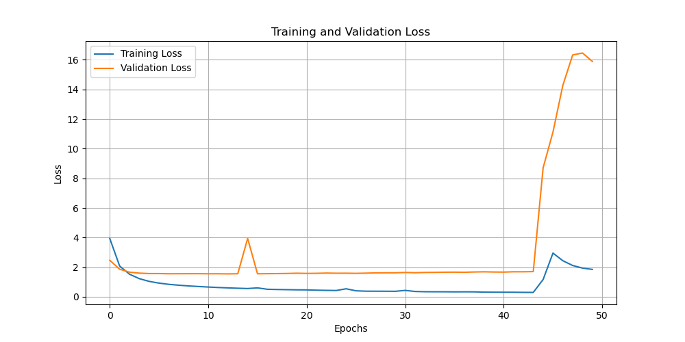

# Transformers

This folder contains an implementation of the Transformer architecture based on the original paper:

> Vaswani, A., Shazeer, N., Parmar, N., Uszkoreit, J., Jones, L., Gomez, A. N., ... & Polosukhin, I. (2017). Attention is All You Need. *Advances in Neural Information Processing Systems (NeurIPS)*.

## Files

- **`model.py`**: Contains the implementation of the Transformer model, including the encoder, decoder, and self-attention mechanisms.
- **`train.py`**: Script to train the Transformer model on a dataset, including data loading, training loop, and checkpoint saving.
- **`eval.py`**: Script to evaluate the Transformer model on the test set, including generating example translations and computing the test loss.


## Highlights

- This implementation is coded entirely from scratch based on the original paper.
- No pre-built libraries (e.g., Hugging Face) were used for the core architecture. We only used Pytorch and Numpy.
- The goal was to deeply understand the workings of the Transformer model by building it myself.

## Features Implemented
- Multi Head Attention
- Handles different max_length for encoder and decoder
- Regularization (Dropout and normalization)
- Causal mask and Padding Mask
- Generate function
- Full custom dataset for traning

## How to Use

1. Ensure you have the required dependencies installed (e.g., PyTorch, NumPy).
2. Download the `fra-eng.zip` file from [ManyThings.org](http://www.manythings.org/anki/)
2. Run `train.py` to train the model:
   ```bash
   python train.py
   ```

Feel free to explore the code to understand the implementation and adapt it to your needs!

## Loss Plot

Below is the plot of the training and validation losses over epochs:



## Evaluation
To evaluate the model on the test set and generate example translations, run the `eval.py` script:
   ```bash
   python eval.py
   ```
The eval.py script will:

- Compute the average test loss.
- Generate and print example translations from the test set.

   ```
   Average Test Loss: 0.1234

   Original: I am a student.
   Translated: Je suis un étudiant.
   Target: Je suis un étudiant.

   Original: This is a test.
   Translated: Ceci est un test.
   Target: Ceci est un test.
   ```


## Data Source
This project uses data from the [Tatoeba Project](http://tatoeba.org) and [ManyThings.org](http://www.manythings.org/anki/).

### Attribution
The dataset used to train the model copmes from the `fra-eng.zip` file.

This data is provided under the [Creative Commons Attribution 2.0 License](http://creativecommons.org/licenses/by/2.0).

### Terms of Use
Please see the terms of use for the dataset:
- [Tatoeba Terms of Use](http://tatoeba.org/eng/terms_of_use)
- [Creative Commons Attribution 2.0 License](http://creativecommons.org/licenses/by/2.0)

